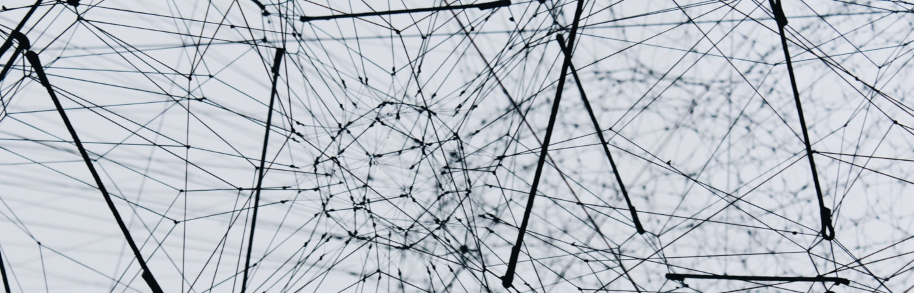

# Overview

Deep learning is becoming a standard tool in chemistry and materials science. Deep learning is specifically about connecting some input data (features) and output data (labels) with a neural network function. Neural networks are differentiable and able to approximate any function. The classic example is connecting a molecule's structure and function. A recent example is dramatically accelerating quantum calculations to the point that you can achieve DFT level accuracy with a neural network. What makes deep learning especially relevant is that it's a powerful tool for approximating previously intractable functions **and** its ability to generate new data.

In this book, we will view deep learning as a set of tools that allows us to create models that were previously infeasible. One example that sets deep learning apart from classic machine learning is feature engineering. Much of the data-driven work in the past required decisions about what features are important and how to compute them from molecules. These are called descriptors. Deep learning is typically trained end-to-end, meaning decisions about which features are important are no longer relevant and we can work directly with molecular structures.

Another reason deep learning is a standard method is its mature tools. Previously, training and using models in machine learning was tedious because it required deriving and implementing new equations for each model. Deep learning has removed this need and model changes can be done nearly effortlessly. Deep learning is not a new paradigm of science or a replacement for a chemist. It's a tool that is mature and now ready for application in molecules and materials.

## Framework Choice

Deep learning is always a little tied up in the implementation details -- it's hard to grasp without seeing code. Thus, framework choice can be a part of the learning process. This book assumes familiarity with Python and `numpy` and we use exclusively Python. For the deep learning framework, we use `Jax`, `Tensorflow`, `Keras`, and `scikit-learn` for different purposes. `Jax` is easy to learn because it's essentially `numpy` with automatic differentiation and GPU/TPU-acceleration. In this book, we use `Jax` when it's important to understand the implementation details and connect the equations to the code. `Keras` is a high-level framework that has many common deep learning features implemented. It is used when we would like to work with more complex models and I'm trying to show a more complete model. Of course, you can use `Jax` for complete models and show detailed implementations in `Keras`. This is just my reasoning for the choice of framework. `scikit-learn` is an ML package and thus we'll see in the early chapters on ML. Finally, `Tensorflow` is the underlying library of `Keras` so if we want to implement new layers in `Keras` we do it through `Tensorflow`. `TensorflowProbability` is an extension to `Tensorflow` that supports random variables and probability distributions used in our generative models. The most important framework left out of this book is `PyTorch`, which has recently taken the lead to be the most popular framework in deep learning research (not necessarily industry). Ultimately, this book presents the equations and implementation details so that you will learn concepts that are independent of the framework. You should thus be able to quickly pick up `PyTorch`, MXNet, or whatever the next new framework might be.

One of the most common mistakes I see from students is that they try to learn deep learning via web searching questions and reading documentation. *This is a terrible way to learn deep learning.* There is quite a bit of information out there, but you will end up with a distorted and framework-specific understanding of deep learning. Remember, a high-ranking search result may be relevant and popular, but that doesn't mean it will help you learn. More importantly, learning deep learning through blogs and Stack overflow makes it so hard to grasp the mathematics and intuition. Web searching and hacking together code is definitely a part of deep learning (for better or worse), but you should do this once you have a firm grasp of the math and details of the model you want to implement.

## Table of Contents

```{tableofcontents}
```

## Citation

Please cite as

> White, Andrew D. *Deep Learning for Molecules and Materials*. 2021.

```bibtex
@book{whiteDeep2021,
  title={Deep Learning for Molecules and Materials},
  author={White, Andrew D},
  url={https://dmol.pub},
  year={2021}
}
```

## Contributors

Thank you to contributors for offering suggestions, identifying errors, and helping improve this book! Twitter handles, if available

### Contributed Content to Chapter

1. Geemi Wellawatte (@GWellawatte)

### Substantial Feedback on Content

1. Lily Wang (@lilyminium)
2. Marc Finzi (@m_finzi)
3. Kevin Jablonka (@kmjablonka)
4. Elana Simon
5. Cathrine Bergh (@cathrinebergh)

### Code Fixes, Math Fixes, Language Fixes

1. Oion Akif
2. Heta Gandhi (@gandhi_heta)
3. Mattias Hartveit
4. Andreas Krämer
5. Mehrad Ansari (@MehradAnsari)
6. Ritsuya Niwayama
7. Varsha Jain
8. Simon Duerr
9. Julia Westermayr (@JWestermayr)
10. Ernest Awoonor-Williams
11. Joshua Schrier (@joshuaschrier)
12. Marin Bukov

## Image Credit

A picture by [@alinnnaaaa](https://unsplash.com/@alinnnaaaa) of art by Tomás Saraceno.

## Funding Support

Research reported in this work was supported by the National Institute of General Medical Sciences of the National Institutes of Health under award number R35GM137966. This material is based upon work supported by the National Science Foundation under Grant No. 1764415.
